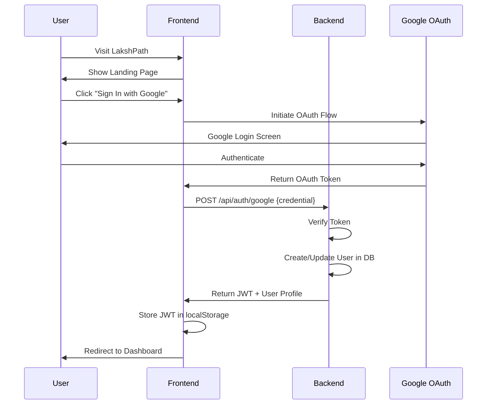
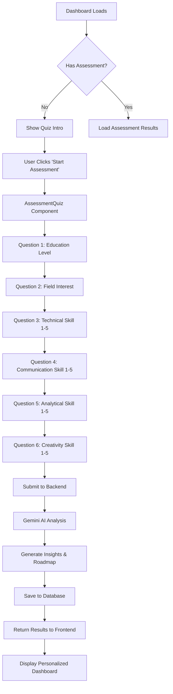
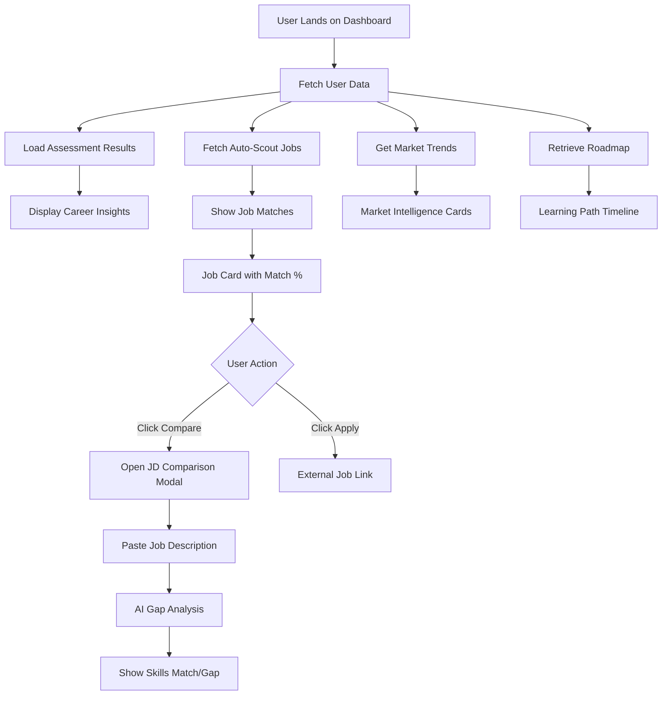
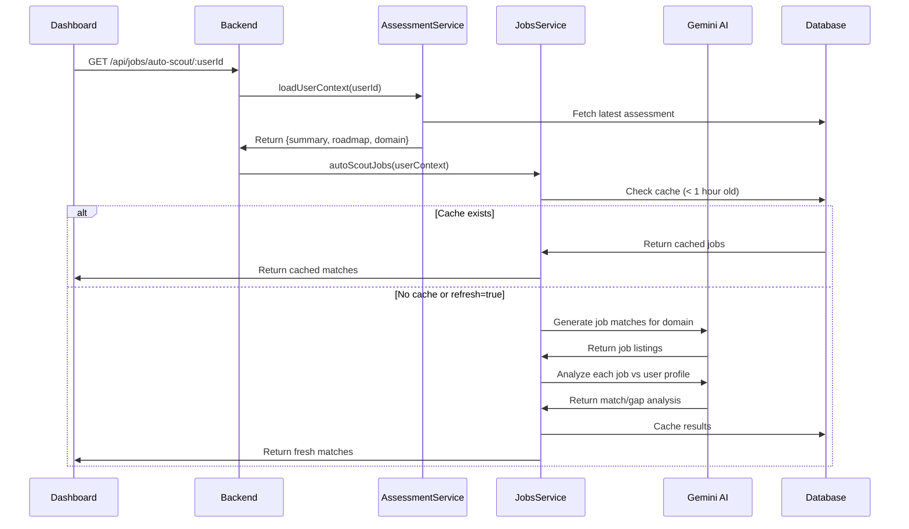
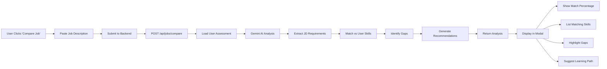
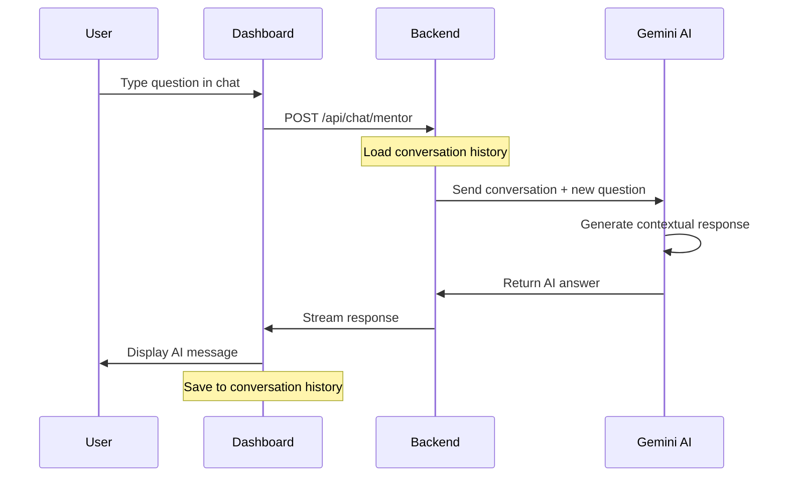

# 📖 LakshPath - Complete Workflow Guide

> **A comprehensive guide to understanding how LakshPath works from user perspective to technical implementation**

---

## 📋 Table of Contents

- [Overview](#-overview)
- [User Journey](#-user-journey)
- [System Architecture](#-system-architecture)
- [Data Flow](#-data-flow)
- [Feature Workflows](#-feature-workflows)
- [Technical Implementation](#-technical-implementation)
- [Developer Workflow](#-developer-workflow)

---

## 🎯 Overview

LakshPath is designed to provide a seamless career guidance experience through AI-powered assessments and intelligent job matching. This document explains how every component works together.

### Key Principles

1. **AI-First Approach** - Gemini AI powers every insight and recommendation
2. **User Privacy** - Secure authentication with JWT and OAuth
3. **Graceful Degradation** - System works even with incomplete data
4. **Real-time Intelligence** - Fresh market data and job matching
5. **Developer-Friendly** - Clear APIs, unified scripts, comprehensive docs

---

## 👤 User Journey

### Phase 1: Discovery & Onboarding



**What Happens:**
1. User lands on `LandingPageNew.tsx`
2. Clicks "Sign In with Google"
3. Google OAuth popup appears
4. User authenticates with Google
5. Frontend receives OAuth token
6. Backend validates token with Google
7. User record created/updated in database
8. JWT session token generated
9. User redirected to dashboard

**Files Involved:**
- `frontend/src/pages/LandingPageNew.tsx` - Landing page
- `frontend/src/pages/LoginNew.tsx` - OAuth handling
- `backend/src/routes/auth.routes.ts` - Auth endpoints
- `backend/src/controllers/authController.ts` - OAuth logic
- `backend/src/services/authService.ts` - Token verification

---

### Phase 2: Career Assessment



**Assessment Questions:**

| Question | Type | Purpose |
|----------|------|---------|
| Education Level | Select | Determines career stage |
| Field of Interest | Select | Domain identification (Software, Data Science, etc.) |
| Technical Skill | Scale 1-5 | Measures coding/technical proficiency |
| Communication Skill | Scale 1-5 | Evaluates soft skills |
| Analytical Skill | Scale 1-5 | Problem-solving capability |
| Creativity Skill | Scale 1-5 | Innovation potential |

**Gemini AI Processing:**

```javascript
// Backend: assessmentService.ts
const prompt = `
You are a career counselor analyzing a student's assessment.

Education: ${answers.educationLevel}
Interest: ${answers.fieldInterest}
Skills:
- Technical: ${answers.technicalSkill}/5
- Communication: ${answers.communicationSkill}/5
- Analytical: ${answers.analyticalSkill}/5
- Creativity: ${answers.creativitySkill}/5

Provide:
1. Career insights (strengths, areas for improvement)
2. Top 3 career recommendations with reasons
3. Personalized learning roadmap (5 steps)
`;

const aiResponse = await gemini.generateContent(prompt);
```

**Files Involved:**
- `frontend/src/pages/QuizIntro.tsx` - Assessment introduction
- `frontend/src/pages/AssessmentQuiz.tsx` - Quiz flow
- `backend/src/routes/assessment.routes.ts` - Assessment endpoints
- `backend/src/controllers/assessmentController.ts` - Request handlers
- `backend/src/services/assessmentService.ts` - Business logic
- `backend/src/services/geminiService.ts` - AI integration
- `backend/prisma/schema.prisma` - Assessment model

---

### Phase 3: Dashboard Experience



**Dashboard Components:**

1. **Profile Section**
   - User name, email, profile picture
   - Assessment completion status
   - Domain/career focus

2. **Career Insights Card**
   - AI-generated strengths
   - Areas for improvement
   - Career recommendations

3. **Auto-Scout Jobs**
   - Automatically matched jobs based on profile
   - Match percentage indicator
   - Skills alignment visualization
   - Gap analysis

4. **Market Intelligence**
   - Real-time salary trends for user's domain
   - Industry demand metrics
   - Top skills in demand
   - Growth projections

5. **Learning Roadmap**
   - Step-by-step learning plan
   - Course recommendations
   - Certification suggestions
   - Project ideas

6. **AI Mentor Chat**
   - Conversational AI assistance
   - Career guidance
   - Resume tips
   - Interview prep

**Files Involved:**
- `frontend/src/pages/DashboardNew.tsx` - Main dashboard
- `frontend/src/services/api.ts` - API client
- `backend/src/routes/jobs.routes.ts` - Job endpoints
- `backend/src/routes/market.routes.ts` - Market data
- `backend/src/routes/roadmap.routes.ts` - Roadmap generation

---

### Phase 4: Job Matching & Comparison

#### Auto-Scout Workflow



**Smart Fallback System:**

```javascript
// When user has no assessment
const DEFAULT_CONTEXT = {
  domain: 'Software Development',
  summary: { educationLevel: 'College', fieldInterest: 'Software' },
  roadmapHighlights: []
};

// Allows job matching even for new users
if (!assessment) {
  return DEFAULT_CONTEXT;
}
```

#### Manual Job Comparison



**Gemini AI Comparison Prompt:**

```javascript
const prompt = `
Compare this job description with the candidate profile:

JOB DESCRIPTION:
${jobDescription}

CANDIDATE PROFILE:
Domain: ${userDomain}
Skills: ${userSkills}
Experience: ${educationLevel}
Strengths: ${assessmentInsights}

Provide:
1. Overall match percentage (0-100)
2. Matching skills (list)
3. Missing skills/gaps (list)
4. Recommendations to improve candidacy
5. Estimated preparation time
`;
```

**Files Involved:**
- `backend/src/services/jobsService.ts` - Job matching logic
- `backend/src/lib/jobsFeed.ts` - Job data provider
- `backend/src/services/geminiService.ts` - AI comparison

---

## 🏗️ System Architecture

### High-Level Architecture

```
┌─────────────────────────────────────────────────────────────┐
│                        USER BROWSER                         │
│  ┌──────────────┐  ┌──────────────┐  ┌─────────────────┐   │
│  │   Landing    │  │    Login     │  │   Dashboard     │   │
│  │     Page     │  │   (OAuth)    │  │  (Main App)     │   │
│  └──────────────┘  └──────────────┘  └─────────────────┘   │
└───────────────────────────┬─────────────────────────────────┘
                            │ HTTPS / REST API
┌───────────────────────────▼─────────────────────────────────┐
│                    EXPRESS BACKEND                          │
│  ┌──────────────────────────────────────────────────────┐   │
│  │              API ROUTES (Express Router)             │   │
│  │  /auth  /assessment  /jobs  /market  /roadmap /chat │   │
│  └────┬─────────────────────────────────────────────────┘   │
│       │                                                      │
│  ┌────▼──────────┐  ┌──────────────┐  ┌────────────────┐   │
│  │ Auth Middle-  │  │ Controllers  │  │ Error Handler  │   │
│  │     ware      │  │              │  │                │   │
│  └────┬──────────┘  └──────┬───────┘  └────────────────┘   │
│       │                    │                                │
│  ┌────▼────────────────────▼─────────────────────────────┐  │
│  │               SERVICE LAYER                           │  │
│  │  authService  assessmentService  jobsService          │  │
│  │  marketService  roadmapService  geminiService         │  │
│  └────┬──────────────────────┬──────────────────────┬────┘  │
└───────┼──────────────────────┼──────────────────────┼───────┘
        │                      │                      │
   ┌────▼─────┐         ┌──────▼──────┐      ┌───────▼────────┐
   │  Prisma  │         │   Gemini    │      │  Google OAuth  │
   │   ORM    │         │  2.0 Flash  │      │   Services     │
   └────┬─────┘         └─────────────┘      └────────────────┘
        │
   ┌────▼──────────┐
   │   SQLite /    │
   │  PostgreSQL   │
   └───────────────┘
```

### Database Schema

```prisma
// Simplified schema

model User {
  id            String        @id @default(uuid())
  email         String        @unique
  name          String?
  googleId      String        @unique
  profilePicture String?
  createdAt     DateTime      @default(now())
  
  assessments   Assessment[]
  jobHistory    JobHistory[]
}

model Assessment {
  id                  String   @id @default(uuid())
  userId              String
  educationLevel      String
  fieldInterest       String
  technicalSkill      Int
  communicationSkill  Int
  analyticalSkill     Int
  creativitySkill     Int
  insights            String   // Gemini AI insights
  roadmap             String   // Learning roadmap
  domain              String   // Career domain
  createdAt           DateTime @default(now())
  
  user                User     @relation(fields: [userId], references: [id])
}

model JobHistory {
  id              String   @id @default(uuid())
  userId          String
  jobDescription  String
  matchAnalysis   String   // Gemini comparison results
  matchPercentage Int
  createdAt       DateTime @default(now())
  
  user            User     @relation(fields: [userId], references: [id])
}

model MarketData {
  id          String   @id @default(uuid())
  domain      String
  salaryData  String   // JSON: {average, min, max}
  demandLevel String
  topSkills   String   // JSON array
  lastUpdated DateTime @default(now())
}
```

---

## 🔄 Data Flow

### Complete Request-Response Cycle

#### Example: Submit Assessment

```
1. USER ACTION
   └─► User completes quiz in AssessmentQuiz.tsx
   
2. FRONTEND (React)
   ├─► Collect form data
   ├─► Validate inputs
   └─► POST /api/assessment with JWT token
       {
         "answers": {
           "educationLevel": "College",
           "fieldInterest": "Software",
           "technicalSkill": 4,
           ...
         }
       }

3. BACKEND (Express Middleware)
   ├─► authenticate middleware verifies JWT
   ├─► Extract userId from token
   └─► Pass to controller

4. CONTROLLER (assessmentController.ts)
   ├─► Validate request body with Zod
   ├─► Extract answers
   └─► Call assessmentService.createAssessment()

5. SERVICE LAYER (assessmentService.ts)
   ├─► Call geminiService.analyzeAssessment()
   │   └─► Gemini AI processes answers
   │       └─► Returns insights, roadmap, domain
   ├─► Save to database via Prisma
   └─► Return assessment object

6. RESPONSE FLOW
   ├─► Controller sends JSON response
   ├─► Frontend receives data
   ├─► Update local state
   ├─► Redirect to dashboard
   └─► Display personalized insights

7. SIDE EFFECTS
   ├─► Auto-trigger job auto-scout
   ├─► Fetch market data for user's domain
   └─► Generate initial roadmap
```

---

## ⚙️ Feature Workflows

### 1. AI Mentor Chat



**Features:**
- Context-aware responses (remembers conversation)
- Career-specific guidance
- Resume feedback
- Interview preparation
- Learning resource suggestions

### 2. Market Intelligence Updates

```javascript
// Scheduled job (runs daily)
async function updateMarketData() {
  const domains = ['Software', 'Data Science', 'Design', 'Business'];
  
  for (const domain of domains) {
    const prompt = `
      Provide current market intelligence for ${domain}:
      1. Average salary in India (INR)
      2. Demand level (High/Medium/Low)
      3. Top 10 in-demand skills
      4. Growth trend (Growing/Stable/Declining)
      5. Key companies hiring
    `;
    
    const aiData = await gemini.generateContent(prompt);
    await prisma.marketData.upsert({
      where: { domain },
      create: { domain, ...parseAIData(aiData) },
      update: { ...parseAIData(aiData), lastUpdated: new Date() }
    });
  }
}
```

### 3. Roadmap Generation

**Input:**
- User's assessment results
- Current skill level
- Target career goal
- Available time commitment

**Process:**
1. Analyze skill gaps
2. Query Gemini for learning path
3. Structure into phases (Beginner → Intermediate → Advanced)
4. Add resource links (courses, projects, certifications)
5. Set milestones and timelines

**Output:**
```json
{
  "roadmap": [
    {
      "phase": "Foundation",
      "duration": "2 months",
      "goals": ["Learn HTML/CSS", "JavaScript basics"],
      "resources": [
        {
          "title": "The Odin Project",
          "type": "Course",
          "url": "https://...",
          "priority": "High"
        }
      ]
    },
    {
      "phase": "Intermediate",
      "duration": "3 months",
      "goals": ["React.js", "REST APIs", "Git"],
      "resources": [...]
    }
  ]
}
```

---

## 💻 Technical Implementation

### Authentication Flow

```javascript
// frontend/src/pages/LoginNew.tsx
import { GoogleOAuthProvider, GoogleLogin } from '@react-oauth/google';

function LoginPage() {
  const handleGoogleSuccess = async (credentialResponse) => {
    const { credential } = credentialResponse;
    
    // Send to backend
    const response = await fetch('/api/auth/google', {
      method: 'POST',
      headers: { 'Content-Type': 'application/json' },
      body: JSON.stringify({ credential })
    });
    
    const { token, user } = await response.json();
    
    // Store JWT
    localStorage.setItem('token', token);
    localStorage.setItem('user', JSON.stringify(user));
    
    // Redirect
    navigate('/dashboard');
  };
  
  return (
    <GoogleOAuthProvider clientId={import.meta.env.VITE_GOOGLE_CLIENT_ID}>
      <GoogleLogin onSuccess={handleGoogleSuccess} />
    </GoogleOAuthProvider>
  );
}
```

```javascript
// backend/src/services/authService.ts
import { OAuth2Client } from 'google-auth-library';
import jwt from 'jsonwebtoken';

export async function verifyGoogleToken(credential: string) {
  const client = new OAuth2Client(process.env.GOOGLE_CLIENT_ID);
  
  const ticket = await client.verifyIdToken({
    idToken: credential,
    audience: process.env.GOOGLE_CLIENT_ID
  });
  
  const payload = ticket.getPayload();
  
  // Create or update user
  const user = await prisma.user.upsert({
    where: { email: payload.email },
    update: { name: payload.name, profilePicture: payload.picture },
    create: {
      email: payload.email,
      googleId: payload.sub,
      name: payload.name,
      profilePicture: payload.picture
    }
  });
  
  // Generate JWT
  const token = jwt.sign(
    { userId: user.id, email: user.email },
    process.env.JWT_SECRET,
    { expiresIn: '7d' }
  );
  
  return { token, user };
}
```

### Gemini AI Integration

```javascript
// backend/src/services/geminiService.ts
import { GoogleGenerativeAI } from '@google/generative-ai';

class GeminiService {
  private genAI: GoogleGenerativeAI;
  private model: any;
  
  constructor() {
    this.genAI = new GoogleGenerativeAI(process.env.GEMINI_API_KEY);
    this.model = this.genAI.getGenerativeModel({ 
      model: process.env.GEMINI_MODEL || 'gemini-2.0-flash' 
    });
  }
  
  async analyzeAssessment(answers: AssessmentAnswers) {
    const prompt = this.buildAssessmentPrompt(answers);
    const result = await this.model.generateContent(prompt);
    const response = result.response.text();
    
    return this.parseAssessmentResponse(response);
  }
  
  async compareJobDescription(userProfile: UserProfile, jobDesc: string) {
    const prompt = `
      Analyze job fit:
      
      CANDIDATE:
      ${JSON.stringify(userProfile, null, 2)}
      
      JOB DESCRIPTION:
      ${jobDesc}
      
      Provide JSON response:
      {
        "matchPercentage": 0-100,
        "matchingSkills": ["skill1", "skill2"],
        "missingSkills": ["skill3", "skill4"],
        "recommendations": "How to improve match",
        "estimatedPrepTime": "2-3 months"
      }
    `;
    
    const result = await this.model.generateContent(prompt);
    return JSON.parse(result.response.text());
  }
}
```

### API Client Pattern

```javascript
// frontend/src/services/api.ts
import axios from 'axios';

const api = axios.create({
  baseURL: import.meta.env.VITE_API_BASE_URL,
  headers: { 'Content-Type': 'application/json' }
});

// Add auth token to every request
api.interceptors.request.use((config) => {
  const token = localStorage.getItem('token');
  if (token) {
    config.headers.Authorization = `Bearer ${token}`;
  }
  return config;
});

// Handle auth errors
api.interceptors.response.use(
  (response) => response,
  (error) => {
    if (error.response?.status === 401) {
      localStorage.clear();
      window.location.href = '/login';
    }
    return Promise.reject(error);
  }
);

export const assessmentAPI = {
  submit: (answers) => api.post('/assessment', { answers }),
  getResults: (userId) => api.get(`/assessment/${userId}`),
  getMyAssessment: () => api.get('/assessment/me')
};

export const jobsAPI = {
  autoScout: (userId, refresh = false) => 
    api.get(`/jobs/auto-scout/${userId}?refresh=${refresh}`),
  compare: (userId, jobDescription) => 
    api.post('/jobs/compare', { userId, jobDescription })
};
```

---

## 👨‍💻 Developer Workflow

### Local Development Setup

```bash
# Day 1: Initial Setup
git clone https://github.com/cybertech-18/LakshPath.git
cd LakshPath
npm install --prefix backend
npm install --prefix frontend
./scripts/setup-env.sh
# Edit .env files with your credentials
cd backend && npm run prisma:migrate && cd ..

# Day 2+: Daily Development
./scripts/start-dev.sh  # Start both servers
# Make changes to code
# Servers auto-reload (Vite HMR + ts-node-dev)
./scripts/stop-dev.sh   # When done
```

### Code Organization Principles

1. **Separation of Concerns**
   - Routes handle HTTP
   - Controllers validate & delegate
   - Services contain business logic
   - Libraries provide utilities

2. **Type Safety**
   - TypeScript everywhere
   - Zod for runtime validation
   - Prisma for type-safe database

3. **Error Handling**
   ```javascript
   // Consistent error responses
   try {
     const result = await riskyOperation();
     res.json({ success: true, data: result });
   } catch (error) {
     next(error); // Caught by error middleware
   }
   ```

4. **Environment Configuration**
   ```javascript
   // backend/src/config/env.ts
   import { z } from 'zod';
   
   const envSchema = z.object({
     PORT: z.string().default('5001'),
     GEMINI_API_KEY: z.string(),
     DATABASE_URL: z.string(),
     // ...
   });
   
   export const env = envSchema.parse(process.env);
   ```

### Adding a New Feature

**Example: Add "Skills Endorsement" Feature**

```bash
# 1. Update database schema
# Edit backend/prisma/schema.prisma
model Endorsement {
  id          String   @id @default(uuid())
  userId      String
  skill       String
  endorsedBy  String
  createdAt   DateTime @default(now())
  
  user        User     @relation(fields: [userId], references: [id])
}

# 2. Run migration
cd backend
npx prisma migrate dev --name add_endorsements

# 3. Create service
# backend/src/services/endorsementService.ts
export class EndorsementService {
  async addEndorsement(userId: string, skill: string, endorserId: string) {
    return prisma.endorsement.create({
      data: { userId, skill, endorsedBy: endorserId }
    });
  }
}

# 4. Create routes
# backend/src/routes/endorsement.routes.ts
router.post('/endorsements', authenticate, async (req, res, next) => {
  try {
    const result = await endorsementService.addEndorsement(...);
    res.json(result);
  } catch (error) {
    next(error);
  }
});

# 5. Add to main router
# backend/src/routes/index.ts
router.use('/endorsements', endorsementRoutes);

# 6. Create frontend API
# frontend/src/services/api.ts
export const endorsementAPI = {
  add: (skill) => api.post('/endorsements', { skill })
};

# 7. Update UI
# frontend/src/pages/DashboardNew.tsx
// Add endorsement button in skills section
```

---

## 🔍 Debugging Tips

### Backend Debugging

```javascript
// Add detailed logging
import { logger } from './utils/logger';

logger.info('Processing assessment', { userId, answers });
logger.error('Gemini API failed', { error: error.message });

// Use Prisma Studio for database inspection
npm run prisma:studio
# Opens http://localhost:5555
```

### Frontend Debugging

```javascript
// React DevTools
// Install Chrome extension

// Log API calls
api.interceptors.request.use((config) => {
  console.log('API Request:', config.method, config.url);
  return config;
});

api.interceptors.response.use((response) => {
  console.log('API Response:', response.status, response.data);
  return response;
});
```

### Common Issues

| Issue | Cause | Solution |
|-------|-------|----------|
| CORS errors | CLIENT_ORIGIN mismatch | Ensure backend .env has correct frontend URL |
| 401 Unauthorized | Expired/invalid JWT | Clear localStorage, re-login |
| Gemini quota exceeded | Too many API calls | Implement caching, use smaller prompts |
| Database locked | SQLite concurrent writes | Switch to PostgreSQL for production |

---

## 📊 Performance Optimization

### Caching Strategy

```javascript
// Cache job auto-scout results for 1 hour
const CACHE_DURATION = 60 * 60 * 1000; // 1 hour

async function autoScoutJobs(userId: string, forceRefresh = false) {
  const cached = await prisma.jobCache.findFirst({
    where: {
      userId,
      createdAt: { gte: new Date(Date.now() - CACHE_DURATION) }
    }
  });
  
  if (cached && !forceRefresh) {
    return JSON.parse(cached.data);
  }
  
  // Fetch fresh data...
  const jobs = await fetchAndAnalyzeJobs(userId);
  
  // Update cache
  await prisma.jobCache.create({
    data: { userId, data: JSON.stringify(jobs) }
  });
  
  return jobs;
}
```

### Frontend Optimization

```javascript
// Lazy load routes
const Dashboard = lazy(() => import('./pages/DashboardNew'));
const Assessment = lazy(() => import('./pages/AssessmentQuiz'));

// Memoize expensive computations
const matchedJobs = useMemo(() => {
  return jobs.filter(job => job.matchPercentage >= 60);
}, [jobs]);

// Debounce search
const debouncedSearch = useDebounce(searchTerm, 500);
```

---

## 🎓 Learning Resources

### For Developers

- [React Documentation](https://react.dev)
- [Express Best Practices](https://expressjs.com/en/advanced/best-practice-performance.html)
- [Prisma Guide](https://www.prisma.io/docs)
- [Google Gemini API](https://ai.google.dev/docs)
- [TypeScript Handbook](https://www.typescriptlang.org/docs/handbook/intro.html)

### For Contributors

1. Read this WORKFLOW.md thoroughly
2. Review [README.md](README.md) for setup
3. Check [CONTRIBUTING.md](CONTRIBUTING.md) for guidelines (coming soon)
4. Browse existing code for patterns
5. Start with "good first issue" labels

---

## 📝 Conclusion

LakshPath combines modern web technologies with cutting-edge AI to deliver personalized career guidance at scale. This workflow document should give you a complete understanding of how the system works.

**Key Takeaways:**

- ✅ User-centric design with seamless OAuth flow
- ✅ AI-powered insights through Gemini integration
- ✅ Graceful error handling and fallbacks
- ✅ Scalable architecture with clear separation of concerns
- ✅ Developer-friendly with unified scripts and clear docs

---

<div align="center">

**Questions?** Open an issue or reach out to [@cybertech-18](https://github.com/cybertech-18)

**Want to contribute?** Check out [README.md](README.md) for getting started

Built with ❤️ for empowering careers through AI

</div>
